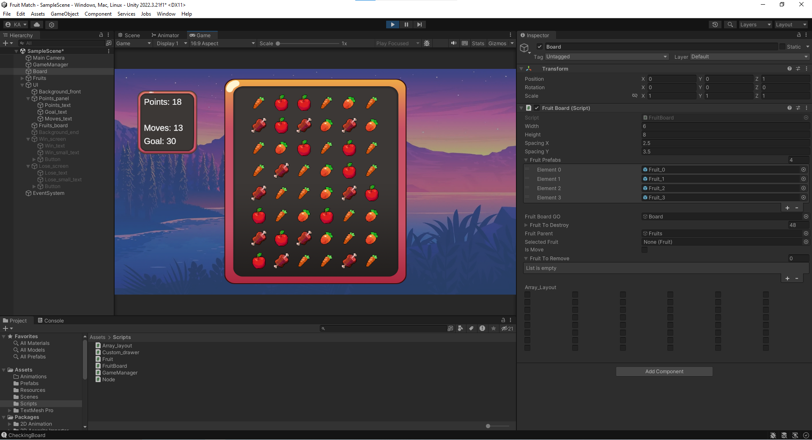
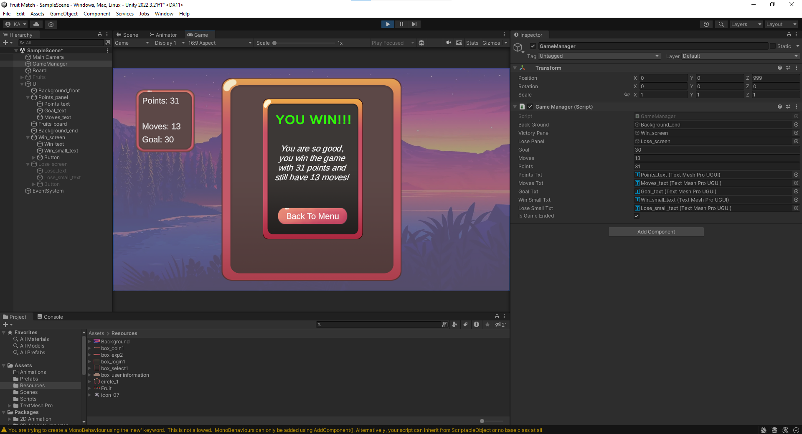
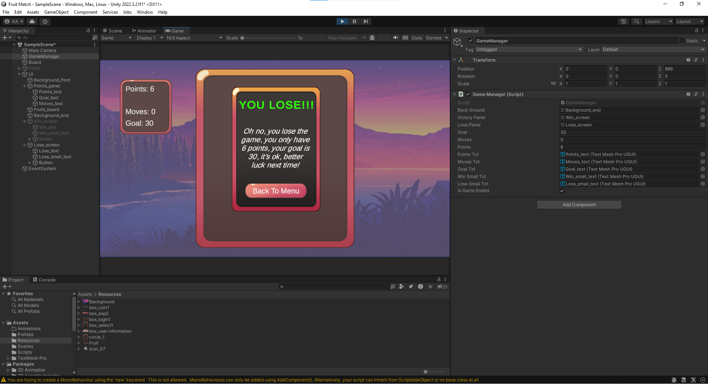

# Fruit-Match
This is a small project I did to learn the basics of using Unity, its gameplay mechanism is quite similar to the game "Candy Crush Saga"

## Techs and Credits
- Unity (C#) - no Audio :(
- Tutorial from Flarvain (Youtube channel)
- Asset from opengameart.org

## Preview

## Unity-preview

